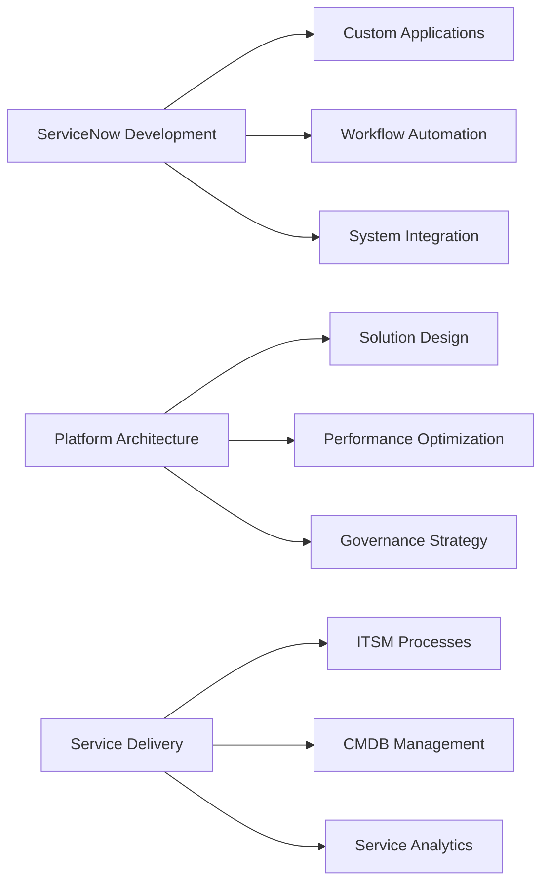

<h1 align="center">👋 Hi, I'm Zubayr Ali</h1>
<h3 align="center">ServiceNow Architect | CSA & CAD Certified | ITIL Expert | Digital Transformation Specialist</h3>


### 🏆 Certifications
<div align="center">
  <a href="https://www.credly.com/badges/a3fbc941-b0dc-42f0-b409-ef21b2ea6bcc" target="_blank" style="margin: 0 15px;">
    
  </a>
  <a href="https://www.credly.com/badges/f7774bfa-412c-4be5-bb23-43f0a6849c05" target="_blank" style="margin: 0 15px;">
    
  </a>
  <!-- ITIL Placeholder -->
  <div style="display: inline-block; margin: 0 15px; vertical-align: top; text-align: center;">
    <div style="width: 150px; height: 150px; background: #f0f0f0; border-radius: 10px; display: flex; flex-direction: column; justify-content: center; align-items: center; padding: 10px; box-shadow: 0 4px 8px rgba(0,0,0,0.1);">
      <div style="font-size: 16px; font-weight: bold; margin-bottom: 5px;">ITIL Expert</div>
      <div style="font-size: 12px;">Coming Soon</div>
    </div>
    <div style="margin-top: 10px; font-size: 12px;">(In Progress)</div>
  </div>
</div>

<!-- Rest of README unchanged -->
---

### 🔧 Technical Arsenal
```diff
+ Platform Expertise: ServiceNow (ITSM, ITAM, ITOM, SPM, HRSD, GRC, SecOps, AIOps)
+ Development: JavaScript | Glide APIs | Flow Designer | UI Builder | App Engine Studio
+ Integration: REST/SOAP APIs | MID Server | OAuth/SAML | JDBC | Web Services
+ Web: AngularJS | HTML5 | CSS3 | Bootstrap | Jelly
+ Cloud/DevOps: AWS | Azure | Git | Jenkins | Docker
+ Methodologies: ITIL v4 | Agile/Scrum | DevOps | AIOps
```

---

### 🏆 Certifications
[](https://www.credly.com/badges/badge-id)
[](https://www.credly.com/badges/badge-id)
[](https://www.credly.com/badges/badge-id)

---

### 🚀 Core Capabilities


---

### 📈 GitHub Stats
<p align="center">
  
  
</p>

---

### ✍️ Knowledge Philosophy
> **"Learning in Public" Advocate** • Building a **Personal Knowledge Management System** with Obsidian.md  
> Documenting ServiceNow patterns, integration blueprints, and implementation strategies  
> Sharing technical insights through [blog posts/notes] • Curating reusable code snippets

---

### 🔗 Connect With Me
<p align="center">
  <a href="https://linkedin.com/in/zubayrali">
    
  </a>
  <a href="https://www.credly.com/users/zubayr-ali/badges">
    
  </a>
  <a href="mailto:your.email@example.com">
    
  </a>
  <a href="https://servicenow.dev">
    
  </a>
</p>
